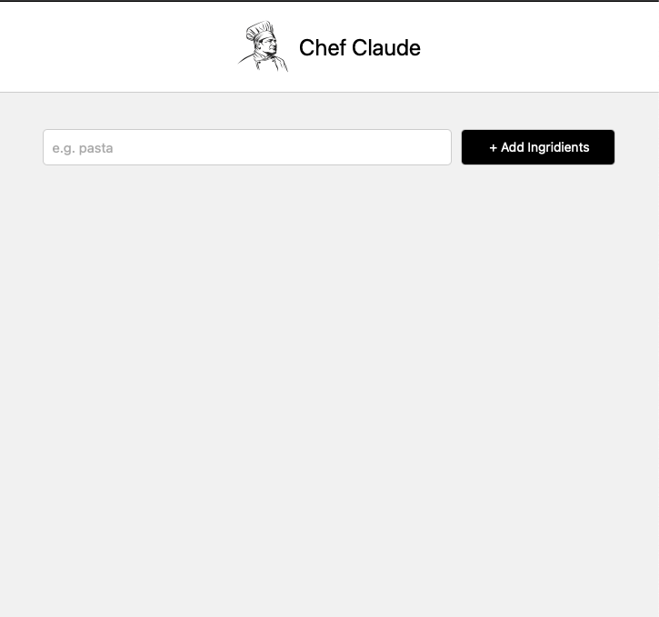

# Chef Claude - Recipe Assistant (Work in Progress)

A React-based recipe assistant application that helps users discover and manage recipes based on ingredients.

## Current Features
- Modern, clean user interface
- Ingredient search functionality
- Responsive design
- Stylish black and white theme

## Project Status
 **Work in Progress** 

This project is currently under active development. More features and improvements will be added soon.

## Screenshots

*Current interface of Chef Claude with ingredient search functionality*

## Tech Stack
- React
- JavaScript
- CSS3
- HTML5

## Getting Started

1. Clone the repository
```bash
git clone [repository-url]
```

2. Install dependencies
```bash
npm install
```

3. Run the development server
```bash
npm start
```

## Future Enhancements
- Recipe display functionality
- Ingredient list management
- Recipe recommendations
- User authentication
- Save favorite recipes

## License
This project is licensed under the MIT License.
